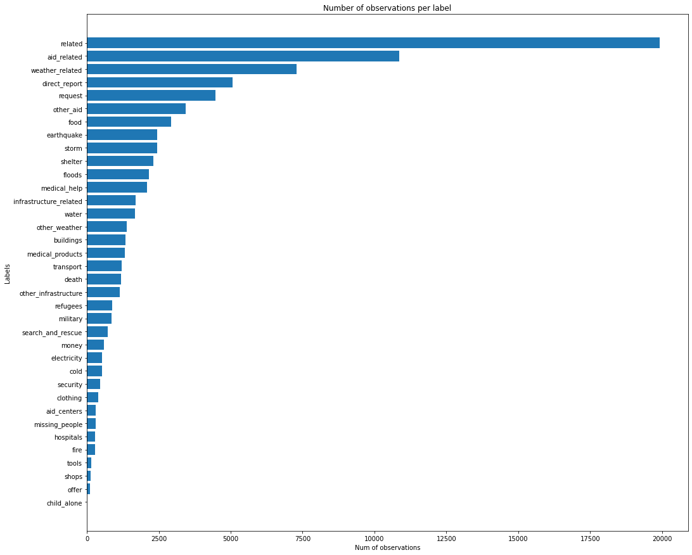
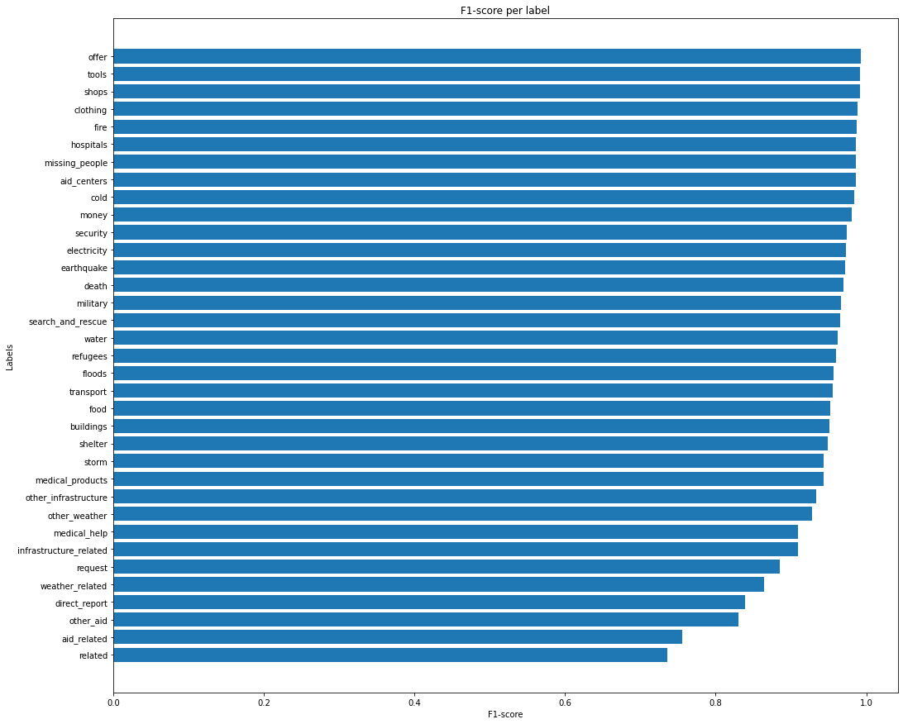

# Disaster Response Pipeline Project

### Table of Contents

1. [Overview](#overview)
2. [Installation](#installation)
3. [Running](#running)
4. [Repository Structure](#repo)
5. [Data Analysis](#data)
6. [Model](#model)
7. [Results](#results)
8. [Final Considerations](#considerations)


## Overview <a name="overview"></a>

When a disaster occurs the organizations are Bombarded with many messages and
at this time is really hard to them to classify what are the most important messages
that usually is only one in every thousand messages.
So to try to help the organizations at this task I built a supervised machine learning
model using the [Figure Eight Inc.](https://www.figure-eight.com/) pre labeled tweets and text messages data.

This project is part of the Udacity Data Science Nanodegree program.

## Installation <a name="installation"></a>

Create a virtual environment named **disaster_venv**.

```
$ python3 -m venv disaster_venv -- for Linux and macOS
$ python -m venv disaster_venv -- for Windows
```

After that, activate the python virtual environment

```
$ source disaster_venv/bin/activate -- for Linux and macOS
$ disaster_venv\Scripts\activate -- for Windows
```

Install the requirements

```
$ pip install -r requirements.txt
```

## Running <a name="running"></a>

1. Run the following commands in the project's root directory to set up your database and model.

    - To run ETL pipeline that cleans data and stores in database
        `python data/process_data.py data/disaster_messages.csv data/disaster_categories.csv data/DisasterResponse.db`
    - To run ML pipeline that trains classifier and saves
        `python models/train_classifier.py data/DisasterResponse.db models/classifier.pkl`

2. Run the following command in the app's directory to run your web app.
    `python run.py`

3. Go to http://0.0.0.0:3001/

## Repository Structure <a name="repo"></a>

- The `data` folder contains the disaster's data and the script to clean and store the data.
- The `models` have the script to train and classify the data.
- The `app` folder with all the python scripts and html to build and run the web project.
- The `requirements.txt` has the needed packages to run the notebook.
- The `notebooks` folder contains the notebook used to train the different models.

## Data Analysis <a name="data"></a>

Figure Eight Inc provided two csv:
1. messages.csv containing:
    - the message id
    - the message in english
    - the message at its original language
    - genre
2. categories.csv containing:
    - the message id
    - the categories of the messages

So the first step at the process_data.py is to format and merge the messages dataframe
with the categories dataframe to get a resulting disaster_df where to each row we have the message id,
the message in english, the original message, the genre and 36 columns one to each one of the categories
and with a 1 value if the message is from that category or 0 value otherwise.
The disaster_df has 26216 rows and bellow it is a graph containing the number of messages for each one
of the 36 categories.



As we can see, this dataset is imbalanced there are labels with more than 10.000 observations such as related and aid_related and there are labels that have less than 1.000 such as child_alone that
have 0 observation.

This could lead to an overfitting of the labels that has few observations.

## Model <a name="model"></a>

It was used Pipeline and FeatureUnion to build a XGBClassifier as you can see bellow.

```
pipeline = Pipeline([
        ('features', FeatureUnion([

            ('text_pipeline', Pipeline([
                ('vect', CountVectorizer(tokenizer=tokenize)),
                ('tfidf', TfidfTransformer())
            ])),

            ('num_verbs', extractor_transformers.CountPosTagTransformer('VB')),
            ('num_nouns', extractor_transformers.CountPosTagTransformer('JJ')),
            ('num_adjectives',
             extractor_transformers.CountPosTagTransformer('PRP')),
            ('num_pronouns',
             extractor_transformers.CountPosTagTransformer('NN'))
        ])),

        ('clf', MultiOutputClassifier(XGBClassifier()))
    ])
```

The `CountPosTagTransformer` counts the number of words of a specific type at the text.

It is also possible to realize a Grid Search at the code, adding the desired parameters at line 107 of train_classifier.py.

 ```
 parameters = {
        'clf__estimator__learning_rate': [0.1, 0.01],
    }
 ```

 Note, that if you add a lot of parameters you have to have a robust setup to run the code.

## Results <a name="results"></a>

It was used the weighted-average F1-score to compare between the models.
This metric can be found using the function `classification_report`.

There were 4 trials:
1. Using CountVectorizer, TfidTransformer and RandomForest named as RandomForest.
2. Using CountVectorizer, TfidTransformer and XGBClassifier named as XGBoost.
3. Using CountVectorizer, TfidTransformer, CountPosTagTransformer for verb, noun, adjective and pronoun
 and XGBClassifier named as XGBoost_More_Features.
4. The same features and model from XGBoost_More_Features and running grid search named as XGBoost_CV.

The Results are shown below.

| Trial                | weighted-average F1-score | 
| ---------------------| --------------------------| 
| XGBoost_More_Features| 0.938832                  |
| XGBoost_CV           | 0.938327                  |
| XGBoost              | 0.937866                  |
| RandomForest         | 0.935922                  |

As we can see all models performance were close to each other, but the model with the best F1-score
was the XGBoost_More_Features. So, let's see how was the performance of this model to each one 



As we can see the labels that have less data in the dataset tended to have a better F1-score then the ones
that have more data. As we can see the labels related and aid_related that are the labels that have more data were
the ones with the worst F1-score.
Probably, it's  happening overfitting on the labels that have less data.

## Final Considerations and acknowledgments <a name="considerations"></a>

Part of the code used is from the Data Engineering module of the Udacity Nanodegree.
Go ahead and contribute to this repository.
Article that shows which metric to use on a multi class problem.
- https://towardsdatascience.com/multi-class-metrics-made-simple-part-ii-the-f1-score-ebe8b2c2ca1

